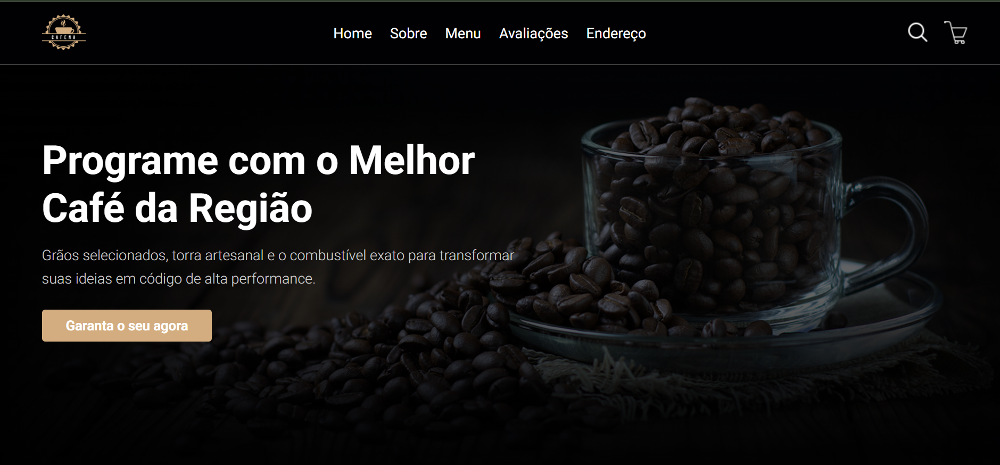
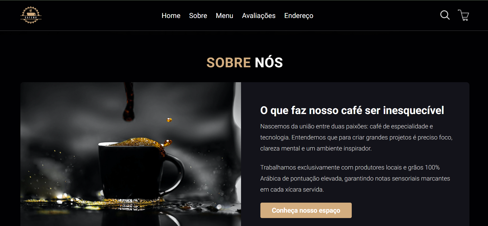
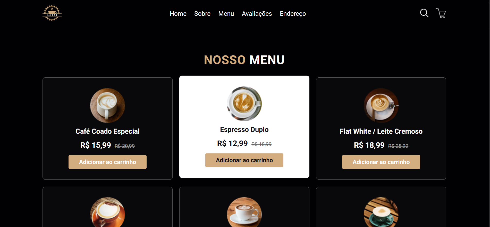
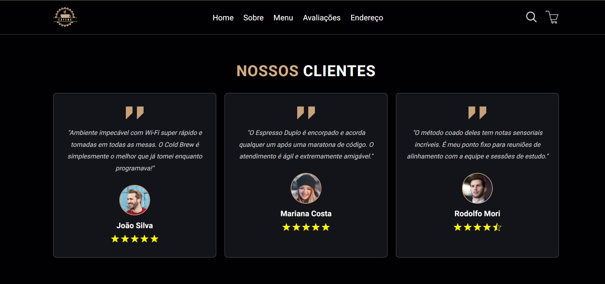

# ☕ Code & Coffee — Landing Page Gourmet


Uma landing page responsiva e moderna desenvolvida para uma cafeteria focada no público de tecnologia. O projeto apresenta um design escuro (dark theme) elegante, navegação suave e um layout otimizado para múltiplos dispositivos.

🔗 **[Acesse o projeto online aqui](https://alexandrecarloss.github.io/projeto-cafeteria)**

---

## 💻 Demonstração

| Home | Sobre |
|---|---|
|  |  |
| **Menu** | **Avaliações** |
|  |  |

---

## ✨ Funcionalidades

- **Navegação Responsiva:** Menu hambúrguer interativo para telas mobile.
- **Rolagem Suave (Smooth Scroll):** Âncoras ajustadas com recuo dinâmico do cabeçalho.
- **Design Moderno:** Utilização de Variáveis CSS (`custom properties`), CSS Grid e Flexbox.
- **Informativo e Funcional:** Seções de Menu com preços promocionais, Avaliações de clientes e Integração com o Google Maps.

---

## 🛠️ Tecnologias Utilizadas

- **HTML5:** Estrutura semântica e acessível (`<header>`, `<nav>`, `<section>`, `<footer>`).
- **CSS3:**
  - Layouts com **Flexbox** e **CSS Grid**.
  - Media queries para design responsivo (Mobile First approach / Breakpoints).
  - Variáveis globais para paleta de cores.
- **JavaScript (ES6):** Manipulação do DOM para ativação do menu responsivo e eventos de clique.

---

## 📂 Como Rodar Localmente

1. Clone o repositório:
```bash
   git clone  https://github.com/alexandrecarloss/projeto-cafeteria.git
```
2. Navegue até o diretório do projeto:
```bash
cd projeto-cafeteria
```
3. Abra o arquivo index.html no seu navegador ou utilize a extensão Live Server do VS Code.

## 📄 License

This project is MIT licensed.

## 👤 Author

[@Carlos Alexandre](https://github.com/alexandrecarloss)

## 🤝 Contributing

Contributions are welcome! Please feel free to submit a Pull Request.
